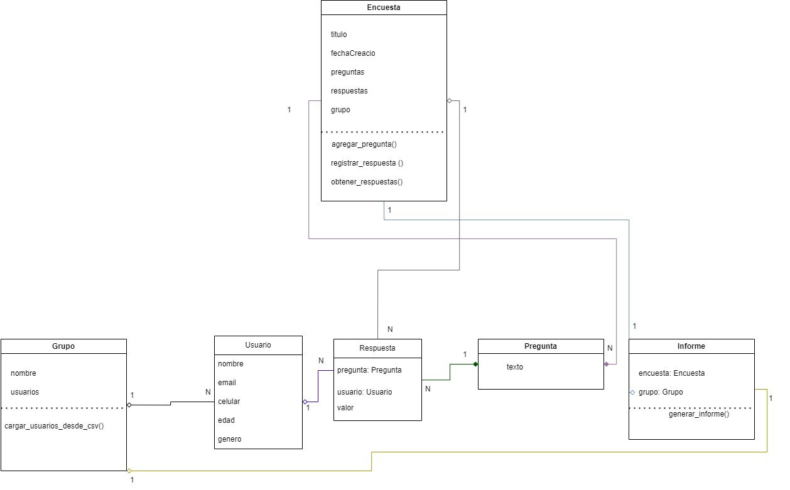

# Diagrama de Clases del Sistema de Gestión de Encuestas

## Clases Principales:

1. **Grupo**: Representa un conjunto de usuarios que serán encuestados. Facilita la organización de las encuestas al agrupar a las personas que recibirán las preguntas.
2. **Usuario**: Define a una persona que responde encuestas, con atributos como nombre, correo electrónico, edad y género.
3. **Encuesta**: Es una colección de preguntas dirigida a los usuarios. Cada encuesta tiene un título y una fecha de creación.
4. **Pregunta**: Representa una pregunta individual dentro de una encuesta, con un texto que el usuario debe responder.
5. **Respuesta**: Registra la respuesta de un usuario a una pregunta específica. Almacena el valor de la respuesta que dio el usuario.
6. **Respuesta**: Genera un resumen de los resultados de una encuesta aplicada a un grupo de usuarios, incluyendo estadísticas como la tasa de respuesta y la distribución de respuestas.

## Relaciones Entre Clases:

1. **Grupo - Usuario**: Un grupo contiene múltiples usuarios, permitiendo organizar a las personas para las encuestas. La relación es de agregación 1-N, ya que un grupo puede tener varios usuarios, pero los usuarios pueden existir sin pertenecer a un grupo.
2. **Encuesta - Pregunta**: Una encuesta está compuesta de múltiples preguntas. La relación es de composición 1-N, porque las preguntas no tienen sentido fuera del contexto de una encuesta.
3. **Pregunta - Respuesta**: Una pregunta puede tener varias respuestas. La relación es de composición 1-N, ya que una respuesta solo existe en el contexto de una pregunta específica.
4. **Usuario - Respuesta**: Un usuario puede proporcionar múltiples respuestas a diferentes preguntas. La relación es de agregación 1-N, ya que las respuestas dependen del usuario que las proporcionó, pero los usuarios pueden existir sin haber respondido preguntas.
5. **Encuesta - Respuesta**: Las respuestas están vinculadas a una encuesta en particular. La relación es de agregación 1-N, ya que una encuesta puede tener varias respuestas de distintos usuarios.
6. **Informe - Encuesta y Grupo**: Un informe genera un análisis de los resultados de una encuesta aplicada a un grupo de usuarios. La relación es de agregación, ya que utiliza tanto la encuesta como el grupo para generar el informe, pero ni la encuesta ni el grupo dependen del informe.

## Interpretación del Diagrama:

Este diagrama UML describe la estructura del sistema de gestión de encuestas, mostrando cómo las clases principales interactúan para gestionar la creación de encuestas, la recopilación de respuestas y la generación de informes. Las relaciones de composición entre Encuesta y Pregunta, y entre Pregunta y Respuesta, aseguran que estos elementos están interconectados de manera lógica y que no pueden existir sin su contexto. La agregación entre Grupo, Usuario y Encuesta garantiza la flexibilidad del sistema, permitiendo que los usuarios existan independientemente de las encuestas, pero que puedan ser organizados y analizados de manera eficiente dentro de los grupos y encuestas que se les asignan.

### Diagrama UML:

